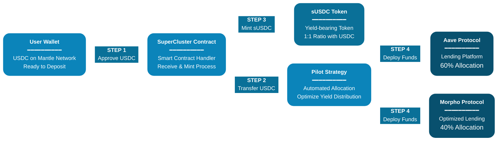

# Deposit Stablecoin

## Overview

Depositing stablecoin is the first step in the SuperCluster user journey. Users deposit USDC into the SuperCluster protocol to start earning yield while maintaining liquidity through receipt tokens.

## What Happens When You Deposit?

When you deposit USDC into SuperCluster:

1. **User Approves USDC Spending** - Grant permission to SuperCluster contract
2. **User Calls `deposit(amount)` Function** - Initiate the deposit transaction
3. **SuperCluster Receives USDC** - Your stablecoins are transferred to the protocol
4. **sUSDC is Minted** - You receive liquid saving tokens at 1:1 ratio
5. **Funds Are Allocated** - Your USDC is distributed to lending protocols via Pilot Strategy

## Step-by-Step Process

### Step 1: Connect Your Wallet

- Connect your wallet to the SuperCluster dApp
- Ensure you have USDC on Mantle Network
- Check you have sufficient MNT for gas fees

### Step 2: Approve USDC

```solidity
// The protocol will request approval to spend your USDC
USDC.approve(SuperClusterAddress, amount)
```

**Why?** This is a standard security measure in DeFi - you must explicitly allow smart contracts to use your tokens.

### Step 3: Enter Deposit Amount

- Specify how much USDC you want to deposit
- Minimum deposit: [To be defined in production]
- Maximum deposit: No limit (subject to protocol capacity)

### Step 4: Confirm Transaction

- Review the transaction details
- Confirm the transaction in your wallet
- Wait for blockchain confirmation

### Step 5: Receive sUSDC

Once the transaction is confirmed:

- You receive sUSDC tokens at a 1:1 ratio
- Your sUSDC balance appears in your wallet
- Yield accrual begins immediately

## Transaction Flow Diagram



## What You Get

| You Deposit  | You Receive   | Value     |
| ------------ | ------------- | --------- |
| 1,000 USDC   | 1,000 sUSDC   | 1:1 ratio |
| 10,000 USDC  | 10,000 sUSDC  | 1:1 ratio |
| 100,000 USDC | 100,000 sUSDC | 1:1 ratio |

**Note:** Initial deposit is always 1:1. As yield accrues, the value of your sUSDC increases through rebasing.

## Behind the Scenes

After you deposit:

### 1. SuperCluster Core Contract

- Receives your USDC
- Mints sUSDC tokens to your address
- Records your share in the protocol

### 2. Pilot Strategy Allocation

- Analyzes current APY across all protocols
- Assesses liquidity and risk parameters
- Determines optimal allocation strategy

### 3. Adapter Execution

- Sends USDC to selected lending protocols
- Executes deposits via protocol-specific adapters
- Begins earning yield immediately

**Example Allocation:**

```
Your 10,000 USDC Deposit:
- 60% → Aave (4,000 USDC)
- 40% → Morpho (3,000 USDC)
```

## Important Notes

### Benefits

- Instant liquidity via sUSDC tokens
- Yield accrual begins immediately
- No lock-up periods
- Composable across DeFi

### Things to Know

- You need USDC on Mantle Network
- Gas fees required for transaction
- Smart contract risk (see Risk Management)
- APY may vary based on market conditions

### Security

- Your USDC is allocated to audited lending protocols
- Pilot Strategy manages diversification
- No single point of failure
- Multi-protocol risk distribution

## Example Scenario

**Sarah wants to earn yield on her USDC:**

1. **Sarah has:** 5,000 USDC on Mantle Network
2. **Sarah deposits:** 5,000 USDC into SuperCluster
3. **Sarah receives:** 5,000 sUSDC immediately
4. **Sarah's USDC is allocated:**
   - 2,000 USDC → Aave (60%)
   - 1,500 USDC → Morpho (40%)
5. **Result:** Sarah starts earning yield from 2 protocols while maintaining full liquidity

## Gas Costs

**Estimated Gas:**

- First-time deposit: Higher (approval + deposit)
- Subsequent deposits: Lower (deposit only)

**Tip:** Consider depositing larger amounts to optimize gas efficiency.

## Next Steps

After depositing:

1. **[Receive sUSDC](./mint_s_usdc.md)** - Your liquid saving tokens are minted
2. **[Wrap to wsUSDC](./wrap_ws_usdc.md)** (Optional) - Convert to non-rebasing token
3. **[Earn Yield](./yield_accrual.md)** - Watch your balance grow through rebase
4. **[Use in DeFi](./use_in_defi.md)** - Deploy your tokens in other protocols

## FAQ

**Q: Is there a minimum deposit amount?**  
A: To be defined in production. During hackathon, no minimum.

**Q: Can I deposit other stablecoins?**  
A: Currently only USDC. Future versions may support USDT, DAI, etc.

**Q: When do I start earning yield?**  
A: Immediately after your deposit is confirmed and allocated.

**Q: Can I withdraw anytime?**  
A: Yes, via two-step withdrawal or instant DEX swap.

**Q: Is my deposit safe?**  
A: Your USDC is allocated to established, audited protocols. See [Risk Management](../protocol_mechanic/risk_and_safety_model.md) for details.

**Ready to deposit?** Connect your wallet and start earning stable, liquid yield today.
